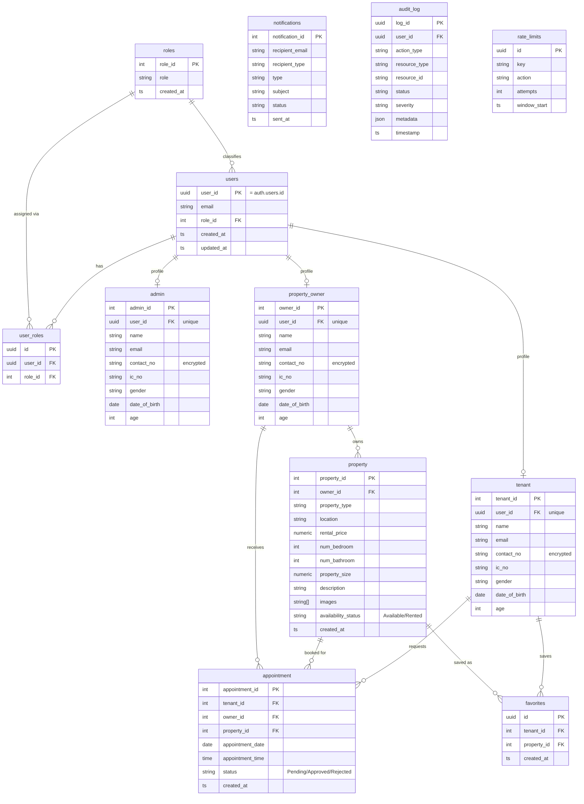
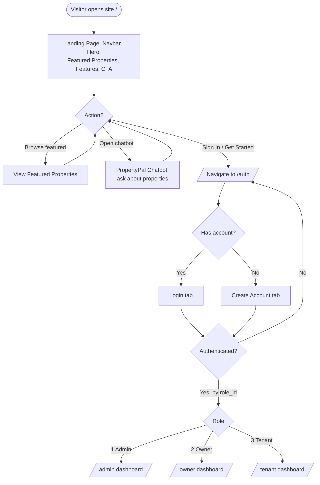
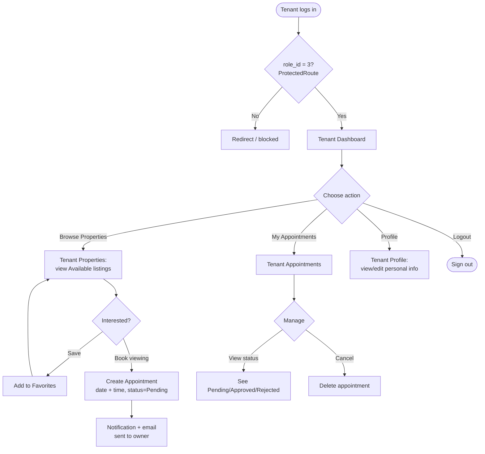
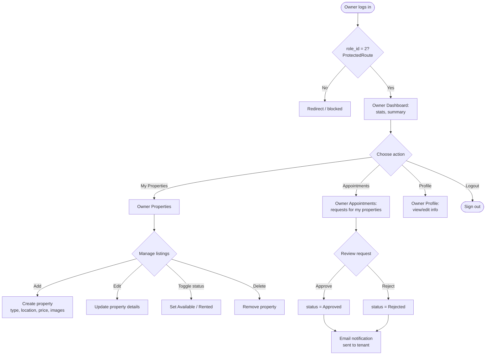
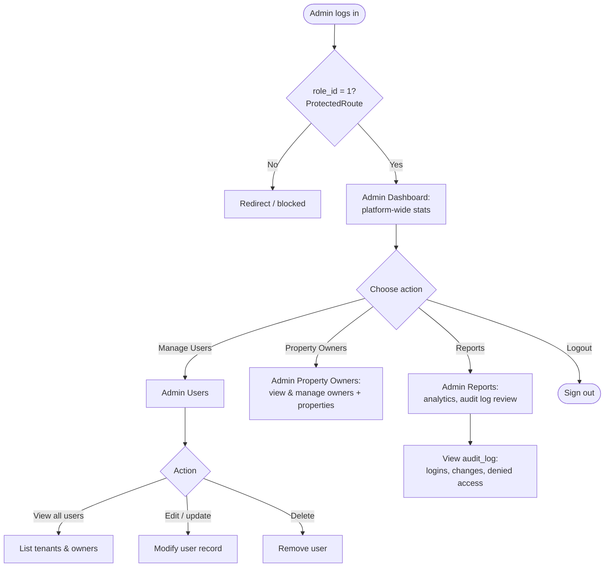

# PropertyPal — System Diagrams

Generated from the current schema (`src/integrations/supabase/types.ts`,
`supabase/migrations/`) and app routing (`src/App.tsx`).

> View these in VS Code's built-in Markdown preview (Mermaid supported), or paste
> any block into <https://mermaid.live> to export PNG/SVG.

---

## 1. Entity Relationship Diagram (ERD)

`notifications`, `audit_log`, and `rate_limits` are operational tables with no hard
FKs to the domain entities. Each role profile (`admin` / `property_owner` /
`tenant`) is a 1:1 extension of a `users` record.

---

## 2. Home (Landing Page) Flowchart

---

## 3. User (Tenant) Flowchart

---

## 4. Property Owner Flowchart

---

## 5. Admin Flowchart

